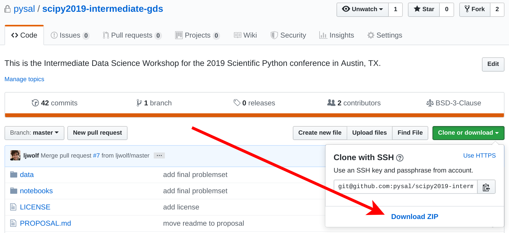

# Scipy 2019 Tutorial - Intermediate Methods for Geospatial Data Analysis

[](https://mybinder.org/v2/gh/pysal/scipy2019-intermediate-gds/master)

### Instructors

- [Levi John Wolf](https://ljwolf.org) - [University of Bristol](http://www.bristol.ac.uk/geography/levi-j-wolf/overview.html) & [University of Chicago Center for Spatial Data Science](https://spatial.uchicago.edu/directory/levi-john-wolf-phd)
- [Sergio Rey](https://sergerey.org/) - [Center for Geospatial Sciences, University of California, Riverside](http://spatial.ucr.edu/peopleRey.html)


This tutorial introduces intermediate concepts in geospatial data analysis in Python, bridging tabular vector data and raster data. The first component of the workshop focuses on intermediate topics in spatial data analysis, such as spatial joins, nearest neighbor queries, regionalization, and zonal statistics. The second component of the workshop focuses on exploratory spatial statistical methods for understanding the structure of spatial data. 

## Outline of the Workshop

- 1:10-1:30: **Installation & setup**

  If you cannot complete the installation instructions ahead of time, please come slightly early so we can work on ensuring everyone can get the required packages installed and so that you can run the workshop material & exercises

- 1:30-2:45: **Relations**

    Working with spatial joins, nearest neighbor joins, geocoding, basemapping, and naive regionalization methods. *(problem set planned for the final 15 minutes)*

- 2:30-3:30: **Rasters**

    Working with raster data, and working between raster and vector data.  *(problem set planned for the final 15 minutes)*

- 3:30-3:45: **Break** 

- 3:45-4:30: **Exploratory spatial data analysis**

  Examining spatial relationships in mathematical terms, including how to represent spatial relations in mathematical forms. 

- 4:30-5:30: **Clustering & Anomaly Detection**

    Understanding and examining the strange and novel spatial structures in data *(problem set planned for the final 15 minutes)*

## Installation notes

Following this tutorial will require recent installations of:

- Python >= 3.5 
- pandas
- geopandas >= 0.3.0
- rasterio
- python-rasterstats
- geopy
- contextily
- matplotlib
- rtree
- libpysal
- scikit-learn
- [Jupyter Notebook](http://jupyter.org)

If you do not yet have these packages installed, we recommend to use the [conda](http://conda.pydata.org/docs/intro.html) package manager to install all the requirements 
(you can install [miniconda](http://conda.pydata.org/miniconda.html) or install the (larger) Anaconda
distribution, found at https://www.anaconda.com/download/).

Once this is installed, the following command will install all required packages in your Python environment:

```
conda env create -f environment.yml
```


## Downloading the tutorial materials

**NOTE:** *We may update the materials up until the workshop. So, please make sure that, if you download the materials, you refresh the downloaded material close to the workshop.*

If you have git installed, you can get the tutorial materials by cloning this repo:

    git clone https://github.com/pysal/scipy2019-intermediate-gds

Otherwise, you can download the repository as a .zip file by heading over
to the GitHub repository (https://github.com/pysal/scipy2019-intermediate-gds) in
your browser, click the green "Download" button in the upper right, and then click the "Download Zip" link:



## Test the tutorial environment

To make sure everything was installed correctly, open a terminal, and change its directory (`cd`) so that your working directory is the tutorial materials you downloaded in the step above. Then enter the following:

```sh
python check_environment.py
```

Make sure that this scripts prints "All good. Enjoy the tutorial!"

