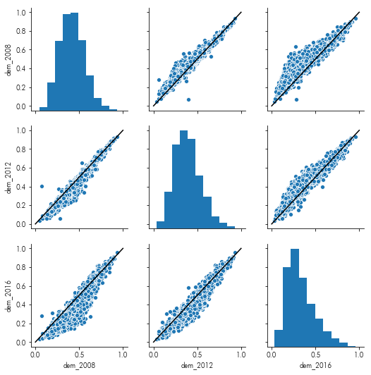
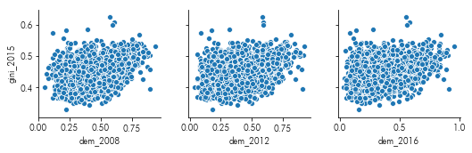
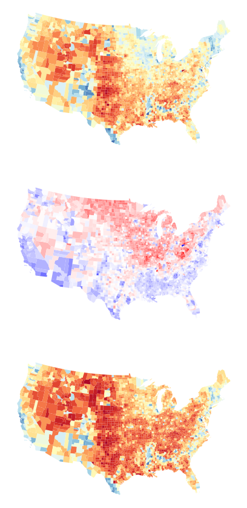
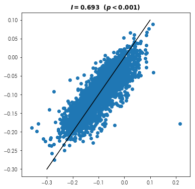
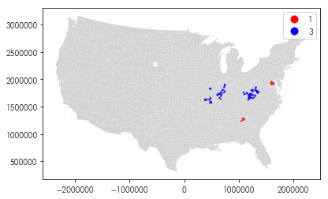
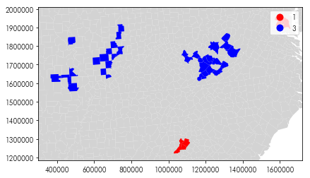
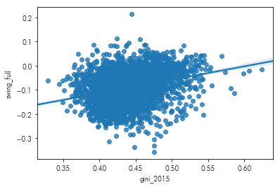
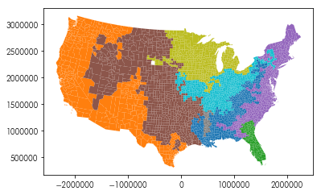
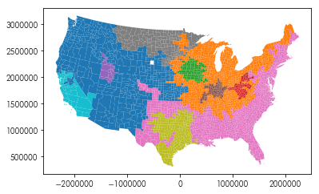

<div markdown="1" class="cell code_cell">
<div class="input_area" markdown="1">
```python
%matplotlib inline

import pandas as pd
import geopandas as gpd
import libpysal as lp
import esda
import numpy as np
import matplotlib.pyplot as plt

```
</div>

</div>


# Case Study: *Gini in a bottle: Income Inequality and the Trump Vote*


## Read in the table and show the first three rows


<div markdown="1" class="cell code_cell">
<div class="input_area" markdown="1">
```python
pres = gpd.read_file("zip://../data/uspres.zip")
pres.head(3)

```
</div>

<div class="output_wrapper" markdown="1">
<div class="output_subarea" markdown="1">


<div markdown="0" class="output output_html">
<div>
<style scoped>
    .dataframe tbody tr th:only-of-type {
        vertical-align: middle;
    }

    .dataframe tbody tr th {
        vertical-align: top;
    }

    .dataframe thead th {
        text-align: right;
    }
</style>
<table border="1" class="dataframe">
  <thead>
    <tr style="text-align: right;">
      <th></th>
      <th>name</th>
      <th>state_name</th>
      <th>stfips</th>
      <th>cofips</th>
      <th>fipsno</th>
      <th>dem_2008</th>
      <th>dem_2012</th>
      <th>dem_2016</th>
      <th>gini_2015</th>
      <th>state</th>
      <th>county</th>
      <th>fips</th>
      <th>geometry</th>
    </tr>
  </thead>
  <tbody>
    <tr>
      <th>0</th>
      <td>Delta</td>
      <td>Michigan</td>
      <td>26</td>
      <td>41</td>
      <td>26041</td>
      <td>0.532316</td>
      <td>0.466327</td>
      <td>0.366585</td>
      <td>0.4268</td>
      <td>26</td>
      <td>041</td>
      <td>26041</td>
      <td>POLYGON ((-86.45813751220703 45.76276779174805...</td>
    </tr>
    <tr>
      <th>1</th>
      <td>Lipscomb</td>
      <td>Texas</td>
      <td>48</td>
      <td>295</td>
      <td>48295</td>
      <td>0.124199</td>
      <td>0.102322</td>
      <td>0.104328</td>
      <td>0.4437</td>
      <td>48</td>
      <td>295</td>
      <td>48295</td>
      <td>POLYGON ((-100.0068664550781 36.49387741088867...</td>
    </tr>
    <tr>
      <th>2</th>
      <td>Walker</td>
      <td>Alabama</td>
      <td>1</td>
      <td>127</td>
      <td>1127</td>
      <td>0.263663</td>
      <td>0.232437</td>
      <td>0.156339</td>
      <td>0.4594</td>
      <td>01</td>
      <td>127</td>
      <td>1127</td>
      <td>POLYGON ((-87.41892242431641 33.60782241821289...</td>
    </tr>
  </tbody>
</table>
</div>
</div>


</div>
</div>
</div>


## Set the Coordinate Reference System and reproject it into a suitable projection for mapping the contiguous US

*hint: the epsg code useful here is [5070](https://spatialreference.org/ref/sr-org/8976/), for Albers equal area conic focused on North America*


<div markdown="1" class="cell code_cell">
<div class="input_area" markdown="1">
```python
pres.crs = {'init':'epsg:4326'}
pres = pres.to_crs(epsg=5070)

```
</div>

</div>


## Plot each year's vote against each other year's vote
In this instance, it also helps to include the line ($y=x$) on each plot, so that it is clearer the directions the aggregate votes moved.   


<div markdown="1" class="cell code_cell">
<div class="input_area" markdown="1">
```python
import seaborn as sns
facets = sns.pairplot(data=pres.filter(like='dem_'))
facets.map_offdiag(lambda *arg, **kw: plt.plot((0,1),(0,1), color='k'))

```
</div>

<div class="output_wrapper" markdown="1">
<div class="output_subarea" markdown="1">


{:.output_data_text}
```
<seaborn.axisgrid.PairGrid at 0x7fcaf577d0f0>
```


</div>
</div>
<div class="output_wrapper" markdown="1">
<div class="output_subarea" markdown="1">

{:.output_png}


</div>
</div>
</div>


## Show the relationship between the dem two-party vote and the Gini coefficient by county.


<div markdown="1" class="cell code_cell">
<div class="input_area" markdown="1">
```python
import seaborn as sns
facets = sns.pairplot(x_vars=pres.filter(like='dem_').columns,
                      y_vars=['gini_2015'], data=pres)

```
</div>

<div class="output_wrapper" markdown="1">
<div class="output_subarea" markdown="1">

{:.output_png}


</div>
</div>
</div>


## Compute change in vote between each subsequent election


<div markdown="1" class="cell code_cell">
<div class="input_area" markdown="1">
```python
pres['swing_2012'] = pres.eval("dem_2012 - dem_2008")
pres['swing_2016'] = pres.eval("dem_2016 - dem_2012")
pres['swing_full'] = pres.eval("dem_2016 - dem_2008")

```
</div>

</div>


Negative swing means the Democrat voteshare in 2016 (what Clinton won) is lower than Democrat voteshare in 2008 (what Obama won).
So, counties where swing is negative mean that Obama "outperformed" Clinton. 
Equivalently, these would be counties where McCain (in 2008) "beat" Trump's electoral performance in 2016.

Positive swing in a county means that Clinton (in 2016) outperformed Obama (in 2008), or where Trump (in 2016) did better than McCain (in 2008). 

The national average swing was around -9% from 2008 to 2016. Further, swing does not directly record who "won" the county, only which direction the county "moved."


## map the change in vote from 2008 to 2016 alongside the votes in 2008 and 2016:


<div markdown="1" class="cell code_cell">
<div class="input_area" markdown="1">
```python
f,ax = plt.subplots(3,1,
                    subplot_kw=dict(aspect='equal', 
                                    frameon=False),
                    figsize=(60,15))
pres.plot('dem_2008', ax=ax[0], cmap='RdYlBu')
pres.plot('swing_full', ax=ax[1], cmap='bwr_r')
pres.plot('dem_2016', ax=ax[2], cmap='RdYlBu')
for i,ax_ in enumerate(ax):
    ax_.set_xticks([])
    ax_.set_yticks([])

```
</div>

<div class="output_wrapper" markdown="1">
<div class="output_subarea" markdown="1">

{:.output_png}


</div>
</div>
</div>


## Build a spatial weights object to model the spatial relationships between US counties


<div markdown="1" class="cell code_cell">
<div class="input_area" markdown="1">
```python
import libpysal as lp
w = lp.weights.Rook.from_dataframe(pres)

```
</div>

</div>


Note that this is just one of many valid solutions. But, all the remaining exercises are predicated on using this weight. If you choose a different weight structure, your results may differ.


## Is swing "contagious?" Do nearby counties tend to swing together?


<div markdown="1" class="cell code_cell">
<div class="input_area" markdown="1">
```python
from pysal.explore import esda as esda
np.random.seed(1)
moran = esda.moran.Moran(pres.swing_full, w)
print(moran.I)


```
</div>

<div class="output_wrapper" markdown="1">
<div class="output_subarea" markdown="1">
{:.output_stream}
```
0.6930802468425128
```
</div>
</div>
</div>


## Visually show the relationship between places' swing and their surrounding swing, like in a scatterplot.


<div markdown="1" class="cell code_cell">
<div class="input_area" markdown="1">
```python
f = plt.figure(figsize=(6,6))
plt.scatter(pres.swing_full, lp.weights.lag_spatial(w, pres.swing_full))
plt.plot((-.3,.1),(-.3,.1), color='k')
plt.title('$I = {:.3f} \ \ (p < {:.3f})$'.format(moran.I,moran.p_sim))

```
</div>

<div class="output_wrapper" markdown="1">
<div class="output_subarea" markdown="1">


{:.output_data_text}
```
Text(0.5, 1.0, '$I = 0.693 \\ \\ (p < 0.001)$')
```


</div>
</div>
<div class="output_wrapper" markdown="1">
<div class="output_subarea" markdown="1">

{:.output_png}


</div>
</div>
</div>


## Are there any outliers or clusters in swing using a Local Moran's $I$?


<div markdown="1" class="cell code_cell">
<div class="input_area" markdown="1">
```python
np.random.seed(11)
lmos = esda.moran.Moran_Local(pres.swing_full, w, 
                              permutations=70000) #min for a bonf. bound
(lmos.p_sim <= (.05/len(pres))).sum()

```
</div>

<div class="output_wrapper" markdown="1">
<div class="output_subarea" markdown="1">


{:.output_data_text}
```
41
```


</div>
</div>
</div>


## Where are these outliers or clusters?


<div markdown="1" class="cell code_cell">
<div class="input_area" markdown="1">
```python
f = plt.figure(figsize=(10,4))
ax = plt.gca()
ax.set_aspect('equal')
is_weird = lmos.p_sim <= (.05/len(pres))
pres.plot(color='lightgrey', ax=ax)
pres.assign(quads=lmos.q)[is_weird].plot('quads', 
                                         legend=True, 
                                         k=4, categorical=True,
                                         cmap='bwr_r', ax=ax)

```
</div>

<div class="output_wrapper" markdown="1">
<div class="output_subarea" markdown="1">


{:.output_data_text}
```
<matplotlib.axes._subplots.AxesSubplot at 0x7fcaf24ff668>
```


</div>
</div>
<div class="output_wrapper" markdown="1">
<div class="output_subarea" markdown="1">

{:.output_png}


</div>
</div>
</div>


## Can you focus the map in on the regions which are outliers?


<div markdown="1" class="cell code_cell">
<div class="input_area" markdown="1">
```python
f = plt.figure(figsize=(10,4))
ax = plt.gca()
ax.set_aspect('equal')
is_weird = lmos.p_sim <= (.05/len(pres))
pres.assign(quads=lmos.q)[is_weird].plot('quads', 
                                         legend=True,
                                         k=4, categorical='True',
                                         cmap='bwr_r', ax=ax)
bounds = ax.axis()
pres.plot(color='lightgrey', ax=ax, zorder=-1)
ax.axis(bounds)

```
</div>

<div class="output_wrapper" markdown="1">
<div class="output_subarea" markdown="1">


{:.output_data_text}
```
(300221.12947796297, 1721965.997477191, 1183473.8523896334, 2010122.0749399317)
```


</div>
</div>
<div class="output_wrapper" markdown="1">
<div class="output_subarea" markdown="1">

{:.output_png}


</div>
</div>
</div>


Group 3 moves surprisingly strongly from Obama to Trump relative to its surroundings, and group 1 moves strongly from Obama to Hilary relative to its surroundings.

Group 4 moves surprisingly away from Trump while its area moves towards Trump. Group 2 moves surprisingly towards Trump while its area moves towards Hilary. 


#### Relaxing the significance a bit, where do we see significant spatial outliers?


<div markdown="1" class="cell code_cell">
<div class="input_area" markdown="1">
```python
pres.assign(local_score = lmos.Is, 
            pval = lmos.p_sim,
            quad = lmos.q)\
    .sort_values('local_score')\
    .query('pval < 1e-3 & local_score < 0')[['name','state_name','dem_2008','dem_2016',
                                             'local_score','pval', 'quad']]

```
</div>

<div class="output_wrapper" markdown="1">
<div class="output_subarea" markdown="1">


<div markdown="0" class="output output_html">
<div>
<style scoped>
    .dataframe tbody tr th:only-of-type {
        vertical-align: middle;
    }

    .dataframe tbody tr th {
        vertical-align: top;
    }

    .dataframe thead th {
        text-align: right;
    }
</style>
<table border="1" class="dataframe">
  <thead>
    <tr style="text-align: right;">
      <th></th>
      <th>name</th>
      <th>state_name</th>
      <th>dem_2008</th>
      <th>dem_2016</th>
      <th>local_score</th>
      <th>pval</th>
      <th>quad</th>
    </tr>
  </thead>
  <tbody>
    <tr>
      <th>2700</th>
      <td>Washington</td>
      <td>Ohio</td>
      <td>0.067810</td>
      <td>0.282640</td>
      <td>-5.992520</td>
      <td>0.000229</td>
      <td>4</td>
    </tr>
    <tr>
      <th>298</th>
      <td>Monroe</td>
      <td>Indiana</td>
      <td>0.662479</td>
      <td>0.624804</td>
      <td>-1.069071</td>
      <td>0.000586</td>
      <td>4</td>
    </tr>
    <tr>
      <th>441</th>
      <td>San Juan</td>
      <td>Utah</td>
      <td>0.477002</td>
      <td>0.355410</td>
      <td>-0.432591</td>
      <td>0.000843</td>
      <td>2</td>
    </tr>
    <tr>
      <th>172</th>
      <td>Eau Claire</td>
      <td>Wisconsin</td>
      <td>0.612624</td>
      <td>0.539251</td>
      <td>-0.329336</td>
      <td>0.000386</td>
      <td>4</td>
    </tr>
    <tr>
      <th>1112</th>
      <td>Sangamon</td>
      <td>Illinois</td>
      <td>0.522164</td>
      <td>0.449798</td>
      <td>-0.303292</td>
      <td>0.000843</td>
      <td>4</td>
    </tr>
    <tr>
      <th>2746</th>
      <td>Monongalia</td>
      <td>West Virginia</td>
      <td>0.519568</td>
      <td>0.443524</td>
      <td>-0.299415</td>
      <td>0.000343</td>
      <td>4</td>
    </tr>
    <tr>
      <th>2920</th>
      <td>Cabell</td>
      <td>West Virginia</td>
      <td>0.448643</td>
      <td>0.365252</td>
      <td>-0.134028</td>
      <td>0.000829</td>
      <td>4</td>
    </tr>
    <tr>
      <th>2648</th>
      <td>Tippecanoe</td>
      <td>Indiana</td>
      <td>0.558866</td>
      <td>0.469750</td>
      <td>-0.024366</td>
      <td>0.000057</td>
      <td>4</td>
    </tr>
  </tbody>
</table>
</div>
</div>


</div>
</div>
</div>


mainly in ohio, indiana, and west virginia


## What about when comparing the voting behavior from 2012 to 2016?


<div markdown="1" class="cell code_cell">
<div class="input_area" markdown="1">
```python
np.random.seed(21)
lmos16 = esda.moran.Moran_Local(pres.swing_2016, w, 
                              permutations=70000) #min for a bonf. bound
(lmos16.p_sim <= (.05/len(pres))).sum()
pres.assign(local_score = lmos16.Is, 
            pval = lmos16.p_sim,
            quad = lmos16.q)\
    .sort_values('local_score')\
    .query('pval < 1e-3 & local_score < 0')[['name','state_name','dem_2008','dem_2016',
                                             'local_score','pval', 'quad']]

```
</div>

<div class="output_wrapper" markdown="1">
<div class="output_subarea" markdown="1">


<div markdown="0" class="output output_html">
<div>
<style scoped>
    .dataframe tbody tr th:only-of-type {
        vertical-align: middle;
    }

    .dataframe tbody tr th {
        vertical-align: top;
    }

    .dataframe thead th {
        text-align: right;
    }
</style>
<table border="1" class="dataframe">
  <thead>
    <tr style="text-align: right;">
      <th></th>
      <th>name</th>
      <th>state_name</th>
      <th>dem_2008</th>
      <th>dem_2016</th>
      <th>local_score</th>
      <th>pval</th>
      <th>quad</th>
    </tr>
  </thead>
  <tbody>
    <tr>
      <th>172</th>
      <td>Eau Claire</td>
      <td>Wisconsin</td>
      <td>0.612624</td>
      <td>0.539251</td>
      <td>-0.680028</td>
      <td>0.000557</td>
      <td>4</td>
    </tr>
    <tr>
      <th>665</th>
      <td>Lake</td>
      <td>California</td>
      <td>0.599217</td>
      <td>0.520347</td>
      <td>-0.175233</td>
      <td>0.000471</td>
      <td>2</td>
    </tr>
    <tr>
      <th>58</th>
      <td>Carbon</td>
      <td>Utah</td>
      <td>0.458791</td>
      <td>0.248662</td>
      <td>-0.158747</td>
      <td>0.000400</td>
      <td>2</td>
    </tr>
    <tr>
      <th>1239</th>
      <td>McDonough</td>
      <td>Illinois</td>
      <td>0.528353</td>
      <td>0.437391</td>
      <td>-0.153826</td>
      <td>0.000014</td>
      <td>4</td>
    </tr>
    <tr>
      <th>3058</th>
      <td>Ohio</td>
      <td>West Virginia</td>
      <td>0.445533</td>
      <td>0.329845</td>
      <td>-0.107886</td>
      <td>0.000643</td>
      <td>4</td>
    </tr>
  </tbody>
</table>
</div>
</div>


</div>
</div>
</div>


##### What is the relationship between the Gini coefficient and partisan swing?


<div markdown="1" class="cell code_cell">
<div class="input_area" markdown="1">
```python
sns.regplot(pres.gini_2015,
            pres.swing_full)

```
</div>

<div class="output_wrapper" markdown="1">
<div class="output_subarea" markdown="1">


{:.output_data_text}
```
<matplotlib.axes._subplots.AxesSubplot at 0x7fcaf119f668>
```


</div>
</div>
<div class="output_wrapper" markdown="1">
<div class="output_subarea" markdown="1">

{:.output_png}


</div>
</div>
</div>


Hillary tended to do better than Obama in counties with higher income inequality.
In contrast, Trump fared better in counties with lower income inequality. 
If you're further interested in the sometimes-counterintuitive relationship between income, voting, & geographic context, check out Gelman's [Red State, Blue State](https://www.amazon.com/Red-State-Blue-Rich-Poor/dp/0691143935). 


## Find 8 geographical regions in the US two-party vote since 2008


<div markdown="1" class="cell code_cell">
<div class="input_area" markdown="1">
```python
from sklearn import cluster

```
</div>

</div>


<div markdown="1" class="cell code_cell">
<div class="input_area" markdown="1">
```python
clusterer = cluster.AgglomerativeClustering(n_clusters=8, connectivity=w.sparse)
clusterer.fit(pres.filter(like='dem_').values)

```
</div>

<div class="output_wrapper" markdown="1">
<div class="output_subarea" markdown="1">


{:.output_data_text}
```
AgglomerativeClustering(affinity='euclidean', compute_full_tree='auto',
            connectivity=<3082x3082 sparse matrix of type '<class 'numpy.float64'>'
	with 17166 stored elements in Compressed Sparse Row format>,
            linkage='ward', memory=None, n_clusters=8,
            pooling_func='deprecated')
```


</div>
</div>
</div>


<div markdown="1" class="cell code_cell">
<div class="input_area" markdown="1">
```python
pres.assign(cluster = clusterer.labels_).plot('cluster', categorical='True')

```
</div>

<div class="output_wrapper" markdown="1">
<div class="output_subarea" markdown="1">


{:.output_data_text}
```
<matplotlib.axes._subplots.AxesSubplot at 0x7fcaf073ab38>
```


</div>
</div>
<div class="output_wrapper" markdown="1">
<div class="output_subarea" markdown="1">

{:.output_png}


</div>
</div>
</div>


## Find 10 geographical clusters in the *change* in US presidential two-party vote since 2008


<div markdown="1" class="cell code_cell">
<div class="input_area" markdown="1">
```python
clusterer = cluster.AgglomerativeClustering(n_clusters=10, connectivity=w.sparse)
clusterer.fit(pres.filter(like='swing_').values)

```
</div>

<div class="output_wrapper" markdown="1">
<div class="output_subarea" markdown="1">


{:.output_data_text}
```
AgglomerativeClustering(affinity='euclidean', compute_full_tree='auto',
            connectivity=<3082x3082 sparse matrix of type '<class 'numpy.float64'>'
	with 17166 stored elements in Compressed Sparse Row format>,
            linkage='ward', memory=None, n_clusters=10,
            pooling_func='deprecated')
```


</div>
</div>
</div>


<div markdown="1" class="cell code_cell">
<div class="input_area" markdown="1">
```python
pres.assign(cluster = clusterer.labels_).plot('cluster', categorical='True')

```
</div>

<div class="output_wrapper" markdown="1">
<div class="output_subarea" markdown="1">


{:.output_data_text}
```
<matplotlib.axes._subplots.AxesSubplot at 0x7fcaf06e7dd8>
```


</div>
</div>
<div class="output_wrapper" markdown="1">
<div class="output_subarea" markdown="1">

{:.output_png}


</div>
</div>
</div>

